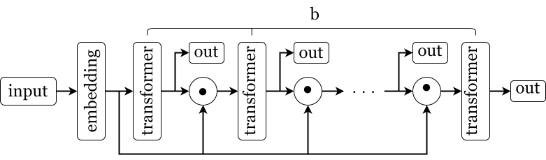

Тестовое задание на LLM Foundations.

<!-- ## Содержание -->
- [Описание сеттинга и проблематики](#описание-сеттинга-и-проблематики)
  - [Способ обучения](#способ-обучения)
  - [Способ валидации](#способ-валидации)
  - [Некоторые термины](#некоторые-термины)
- [Некоторые мысли по поводу тестового задания](#некоторые-мысли-по-поводу-тестового-задания)
- [Эксперимент 1: влияние скейлинга модели на результат и экстраполяцию.](#эксперимент-1-влияние-скейлинга-модели-на-результат-и-экстраполяцию)
- [Эксперимент 2: изменение глубины vs изменение числа итераций.](#эксперимент-2-изменение-глубины-vs-изменение-числа-итераций)
- [Эксперимент 3: оценка влияния Positional Encoding и каузальной маски.](#эксперимент-3-оценка-влияния-positional-encoding-и-каузальной-маски)
- [Эксперимент 4: сравнение различных Input Injection методов.](#эксперимент-4-сравнение-различных-input-injection-методов)
- [Эксперимент 5: проверка последствий обрезания инпута до n примеров.](#эксперимент-5-проверка-последствий-обрезания-инпута-до-n-примеров)
- [Что можно сделать ещё?](#что-можно-сделать-ещё)
- [Как устроен код и как его запустить](#как-устроен-код-и-как-его-запустить)

## Описание сеттинга и проблематики

Пусть мы рассматриваем некоторый класс параметризованных функций, который мы обозначим $\mathcal{F}$. Нам дана коллекция пар вида $(\mathbf{x}, f_i(\mathbf{x}))$, где, положим, $f_i \in \mathcal{F} : \mathbb{R}^n \to \mathbb{R}^m$ и $i = \overline{1, K}$.

Разобьём наш набор данных следующим образом:

```math
D = \text{число различных функций } K \times \text{число различных примеров } N_i
```

И представим его в таком виде:

```math
D = \begin{cases} \mathbf{x}_{1,1} & f(\mathbf{x}_{1,2}) & ... & \mathbf{x}_{1,N_1+1} & f(\mathbf{x}_{1,N_1+1}) \\ ... & ... & ... & ... & ... \\ \mathbf{x}_{K,1} & f(\mathbf{x}_{K,2}) & ... & \mathbf{x}_{K,N_K+1} & f(\mathbf{x}_{K,N_K+1}) \end{cases}
```

Для удобства положим, что $N_1 = N_2 = ... = N_K$.

Нашей задачей является обучение модели, которая способна на основе примеров некоторой функции $f$ предсказывать её значение при заданном $\mathbf{x}$. Если классические нейросетевые модели представляют собой универсальные аппроксиматоры функций, то в данном случае мы хотим построить аппроксимацию более общего характера.

Мы используем модель на основе архитектуры трансформер, а в качестве способа решения задачи рассматриваем in-context learning. Авторы [статьи](https://arxiv.org/abs/2311.12424) используют следующий способ формирования входной матрицы: (при $m < n$):

```math
\begin{bmatrix} \mathbf{x}_1 \\ f(\mathbf{x}_1) \\ \mathbf{x}_2 \\ f(\mathbf{x}_2) \\ ... \\ \mathbf{x}_{N+1} \end{bmatrix} = \begin{bmatrix} x_{1,1} & x_{1,2} & ... & x_{1,m} & x_{1,m+1} & ... & x_{1,n} \\ f_{1,1} & f_{1,2} & ... & f_{1,m} & 0 & ... & 0 \\ x_{2,1} & x_{2,2} & ... & x_{2,m} & x_{2,m+1} & ... & x_{2,n} \\ f_{2,1} & f_{2,2} & ... & f_{2,m} & 0 & ... & 0 \\ ... & ... & ... & ... & ... & ... & ... \\ x_{N+1,1} & x_{N+1,2} & ... & x_{N+1,m} & x_{N+1,m+1} & ... & x_{N+1,n} \end{bmatrix},
```

и на основании этого входа модель должна предсказать вектор

```math
f(\mathbf{x}_{N+1}) = \begin{bmatrix}
f_{N+1,1} & f_{N+1,2} & ... & f_{N+1,m} \end{bmatrix}
```

Говорим, что в данном случае модель получает $N$ in-context примеров и $1$ запрос.

Каждую строку такой матрицы я называю токеном. Обучать трансформер я буду как в задаче Next Token Prediction, заставляя его предсказывать смещённую на один токен входную матрицу, в которой последним токеном является $f(\mathbf{x}_{N+1})$.

Мы используем трансформер несколько нестандартным образом: вместо того, чтобы один раз пропустить данные через модель, мы совершаем $b$ итераций:



Слой `embedding` преобразует матрицу размером $[2N+1, n]$ в матрицу размером $[2N+1, d]$. Блок `transformer` состоит из Self-Attention и MLP слоя в классической реализации. На каждой итерации `transformer` используется один и тот же, т.е. с одинаковыми весами. Все `out` записываются в массив и возвращаются как список из $b$ элементов.

Вместо того, чтобы каждую итерацию просто подавать на вход трансформеру выход из предыдущей итерации, я, вслед за авторами статьи, применяю операцию ⊙. Эта техника называется Input Injection, а сама операция, в сущности, может быть произвольной - это может быть сложение, или применение какого-то нелинейного преобразования (в т.ч. конкатенация или нечто подобное), или использование какого-то промежуточного обучаемого слоя. В эксперименте 4 я рассматриваю несколько вариантов Input Injection.

### Способ обучения

Я использую следующую функцию потерь:

```math
\frac{1}{nb} \sum_{j=1}^{b} \frac{1}{N+1} \sum_{i=1}^{N+1}(f_j(\mathbf{x}_i) - \text{out}_{j,i})^2,
```
где $f_j$ - это просто $j$-я копия $f(\mathbf{x}_i)$. Таким образом, каждый выход `out` сравнивается с таргет вектором, тем самым модель, предположительно, стремится минимизировать ошибку уже на первых итерациях. Значение функции потерь затем усредняется по каждому батчу.

Я обнаружил, что значение функции потерь на первых шагах обучения пропорционально числу измерений $n$, поэтому добавляю коэффициент $n^{-1}$. Кроме того, авторы статьи используют такой трюк, как scheduling - они считают функцию потерь не по всем $b$ итерациям, а только по некоторым последним $T$ итерациям. Для моих экспериментов использование scheduling незначительно влияет на потребление памяти, поэтому я решил использовать все доступные выходы модели. Гораздо сильнее на потребление памяти влияет то, что при увеличении $b$ мы кратно увеличиваем память, необходимую для хранения промежуточных состояний алгоритма autograd.

Все эксперименты я провожу с несколькими зёрнами генерациии и смотрю на усреднённые результаты. Поскольку мои вычислительные ресурсы относительно ограничены (1660 Super), а Кагл я подключил только на второй неделе, я использую относительно небольшое число зёрен, небольшие модели и использую относительно небольшие батчи. Когда я сравниваю какие-либо модели, я делаю размер батча одинаковым.

Каждую итерацию обучения генерируется случайный батч следующим образом. Сначала генерируется $N + 1$ точек с размерностью $8$ или $12$, затем вектор коэффициентов линейной регрессии и для каждого координатного вектора вычисляется одно вещественное значение. Таким образом, каждая матрица в батче представляет собой сэмпл для конкретно одной функции из всего класса, который мы рассматриваем. В данном случае все величины сэмплируются из $\mathcal{N}(0, 1)$ или $\mathcal{N}(0, 2)$.

### Способ валидации

Валидация у нас двухуровневая. Первый уровень - это тренировочная валидация, которая позволяет нам смотреть на процесс обучения модели. Она происходит перед обучением, а затем на каждых 20% обучения, таким образом получается всего шесть раз. В качестве таргета берутся не все токены из каждого выхода, а только последний токен, соответствующий $f(\mathbf{x}_{N+1})$. Т.е. валидация оценивает качество предсказания исключительно следующего (последнего) токена, тогда как тренировочный лосс сравнивает все токены. Так же, как и в процессе обучения, мы берём выходы каждой итерации $b$, и итоговое значение метрики делим на размерность координатного вектора:

```math
\frac{1}{nb} \sum_{j=1}^{b} \frac{1}{N+1} (f_j(\mathbf{x}_{N+1}) - \text{out}_{j,N+1})^2,
```

Второй этап валидации, результаты которого попадают в отчёт, устроен так. Пусть мы обучаем $M$ моделей на $B$ различных значениях $b_{\text{train}}$, и каждый раз мы используем $S$ различных зёрен. Всего выходит $P = M \times B \times S$ запусков для одного эксперимента. Для каждого из этих $P$ запусков мы $10$ раз производим валидацию со случайными средним и стандартным отклонением. Для каждой из $Q = M \times B$ моделей демонстрируется $10 \times S$ различных тестовых датасетов и соответственно значения валидационной метрики. Для деталей реализации обратитесь к ноутбуку какого-либо эксперимента. В экспериментах 4 и 5 изменено число запусков с $10$ на $15$, и в каждом запуске показывается не $10$ батчей, а $25$.

### Некоторые термины

Под **обобщающей способностью** я понимаю способность модели хорошо работать на Out-of-Distribution данных. 

Под **экстраполяцией** модели (способностью к экстраполяции) я понимаю способность модели работать хорошо с $b > b_{\text{train}}$. Например, если модель A и модель B обучались при $b_{\text{train}} = 10$, и если при, например, $b = 50$ модель А показывает лучший результат, чем модель B, то я говорю, что модель А лучше экстраполируется. Т.к. модель должна аппроксимировать не просто функцию, а целый сходящийся алгоритм, экстраполяция означает также и то, насколько модель хорошо выучила этот алгоритм.

Под **натуральной экспрессивностью** я понимаю способность модели аппроксимировать зависимость в данных, которая исходит из самой архитектуры модели и числа параметров; соответственно, добавление итераций, изменение способа тренировки, подбор иных данных и т.п. - это её противоположность.

## Некоторые мысли по поводу тестового задания

В пункте про **Information Flow** сказано:

> То есть, они конкатенируют инпут так, чтобы модель не забывала значение исходных чисел. 
> 
> Гипотеза
> 
> В таком случае, модель имеет возможность использовать часть токенов как хранилище информации с предыдущего шага.
> 
> Можно ли использовать меньше токенов для этого? то есть, подавать с предыдущего шага не все токены, а только n последних?

1. Авторы не конкатенируют инпут, они складывают выход итерации с эмбеддингом инпута. С другой стороны, это не единственная возможная операция - в эксперименте 4 я также рассмотрел конкатенацию по строкам.
2. Можно. Так как трансформеры могут обрабатывать последовательности произвольной длины (в зависимости от реализации), мы можем на каждой итерации каким-либо образом обрезать инпут. С другой стороны не очень понятно, как конкретно это делать: каким-то образом конкатенировать инпут с выходом итерации, или просто обрезать выход итерации, а если обрезать - то брать первые n токенов или каждый раз подавать всё меньше и меньше? Во всяком случае, эксперимент 5 показывает некоторые результаты касательно этого.

В пункте про **Looped-n-Layers** сказано:

> Что будет если зациклить не один а несколько слоев? 

В исходной статье уже дан ответ на этот вопрос: результат получится лучше. Они меняют некоторые параметры модели и смотрят на полученный результат, в том числе и количество слоёв $L$. В эксперименте 2 я несколько развиваю эту тему и провожу эксперимент иного рода, который направлен на сравнение эффектов от увеличения $L$ и увеличения $b$. Этот же эксперимент следует провести с учётом не просто количества слоёв и итераций, а вычислительных ресурсов - нужно сравнивать между собой модели, которые обучать одинаково дорого.

## Эксперимент 1: влияние скейлинга модели на результат и экстраполяцию.

В данном эксперименте я анализирую, как размер модели влияет на способность к экстраполяции, а заодно смотрю, как изменение числа итераций и размера модели влияет на итоговый результат.

[Ссылка на отчёт.](./results/experiment%201/README.md)

Основные выводы:

- Маленькая модель потенциально может достичь результата модели с числом параметров на порядок больше, если подобрать достаточное число тренировочных итераций.
- Увеличение качества за счёт увеличения итераций не бесплатное, и при этом оно имеет свой предел и может выйти на плато в силу ограниченной экспрессивности исходной модели.
- Вероятно, чем более экспрессивную модель мы используем, тем легче ей обучиться на $b_{\text{train}}$ и тем сложнее ей достичь того же уровня качества на $b > b_{\text{train}}$. То есть слабые модели лучше и легче экстраполируются на большее число итераций, но при этом выдают большую ошибку в целом.
- Я предполагаю, что экспрессивная модель может переобучиться под $b_{\text{train}}$ в том смысле, что она начнёт значительно ухудшать качество на больших итерациях за счёт улучшения качества на $b_{\text{train}}$.

## Эксперимент 2: изменение глубины vs изменение числа итераций.

В данном эксперименте я рассматриваю, что будет, если взять одинаковый слой и менять либо количество таких слоёв, либо $b$.

[Ссылка на отчёт.](./results/experiment%202/README.md)

Основные выводы:

- Увеличивать число слоёв, то есть натуральную экспрессивность модели, значительно выгоднее в плане качества, нежели увеличивать число итераций, но менее выгодно в плане экстраполяции, если мы хотим по каким-то причинам заставить модель и обобщаться, и работать на больших $b$, и получить сходящийся алгоритм.

## Эксперимент 3: оценка влияния Positional Encoding и каузальной маски.

В этом эксперименте я провёл эмпирическое сравнение того, как два вида Positional Encoding и каузальная маска влияют на способность модели к обучению.

[Ссылка на отчёт.](./results/experiment%203/README.md)

Основные выводы:

- Позиционное кодирование и каузальная маска дают значительное улучшение качества работы моделей.
- Обучаемый позиционный эмбеддинг лучше, чем синусоидальный.

## Эксперимент 4: сравнение различных Input Injection методов.

В этом эксперименте я сравниваю между собой несколько разных методов распространения информации по итерациям.

[Ссылка на отчёт.](./results/experiment%204/README.md)

Основные выводы:

- Стандартное сложение выхода итерации и эмбеддинга инпута даёт гораздо более стабильное обучение, нежели использование других методов.
- В то же время этот метод показывает худшую экстраполяцию по сравнению с 1) отсутствием Input Injection и со 2) сложением + умножением на обучаемую матрицу.

## Эксперимент 5: проверка последствий обрезания инпута до n примеров.

В этом эксперименте я смотрю, что будет, если взять $n$ примеров из $N$ поданных на вход модели.

[Ссылка на отчёт.](./results/experiment%205/README.md)

Основные выводы:

- Обрезка контекста ухудшает результат на $b_{\text{train}}$, но по каким-то причинам незначительно влияет на результат при сильно больших $b$ (т.е. на экстраполяцию).
- Возможно, гипотеза 1 из эксперимента 1 не верна, а гипотеза 3 верна. Однако это пока довольно слабый вывод.

## Что можно сделать ещё?

1. Применить Looped Transformer к различным задачам NLP (за исключением сеттингов тех работ, в которых это уже сделано).
2. Может итерации могут быть как-то связаны с Chain of Thought или подобными техниками?
3. Проанализировать SSM версий и их сравнение с трансформерами. Мне так и не удалось заставить SSM работать, а кроме этого надо было также провести эксперименты для того чтобы понять как их лучше обучать, так что я решил сфокусироваться на более прямолинейных вопросах т.к. SSM не были в приоритете. Кроме того, SSM скорее всего точно так же будут требовать Input Injection и не будут заменять сам Looped Transformer.
4. Сравнить модели на различных классах функций и на различных прочих задачах. Например, научить трансформер выполнять оставшиеся шаги градиентного спуска по нескольким в in-context примере, или реализовать какие-либо алгоритмы, в которых на вход подаётся не набор векторов, а набор матриц.
5. Сравнить различные способы формирования инпута. Например, я хотел рассмотреть такой вариант, что мы будем добавлять значение функции не следующим за координатами токеном, а конкатенировать их горизонтально. Т.е. вместо матрицы размера $2N + 1 \times n$ мы будем формировать матрицу $N + 1 \times n + m$, тем самым уменьшать число токенов, подаваемых на вход модели. Но это было несколько долго реализовывать и в приоритете не стояло, поэтому я отложил задачу.
6. Переделать все эксперименты с более умными критериями выбора сравниваемых моделей и оценки качества.
7. Рассмотреть обучение модели без стакания таргета $b$ раз, а взяв только предикт последней итерации. Будет ли какое-то существенное изменение?
8. Поменять $b$ на какую-то другую букву.

## Как устроен код и как его запустить

Под каждый эксперимент отведён свой ноутбук с процедурой обучения моделей. Устроены они все следующим образом: вначале идёт загрузка необходимых библиотек и модулей, затем следует код с реализацией исследуемой архитектуры (которая несколько отличается от задачи к задаче), за исключением экспериментов 1 и 2, затем создаются конфигурации используемых моделей и происходит собственно запуск обучения для каждой модели по различным зёрнам генерации. Затем происходит валидация моделей и сохранение результатов на диск.

В файле `transformer.py` приведена реализация трансформера, на которую я ориентируюсь. Она в основном взята [отсюда](https://www.youtube.com/watch?v=l8pRSuU81PU). Класс `BaseLoopedTransformer` используется в экспериментах 1 и 2, в нём реализована исключительно каузальная маска, обычное сложение в качестве Input Injection и нет Positional Encoding. В файле `utils.py` реализован цикл обучения моделей, цикл валидации первого уровня (на который я смотрю во время тренировки моделей), функция установки зерна генерации и функция сохранения результатов обучения на диск.

Часть кода я активно переиспользую, потому что мне так было удобнее (в силу различия некоторых моментов между экспериментами). В первую очередь это относится к циклу, в котором я создаю wandb run, вызываю цикл обучения и сохраняю результат, а также к циклу валидации после обучения. Т.к. в некоторых экспериментах требуется поменять внутренности архитектуры, я переписываю часть кода трансформера заново. Было бы неплохо сделать репозиторий более компактным, но это сделать не так сложно. 

Есть куда улучшать кодовую базу.

Чтобы запустить код, достаточно выполнить последовательно ячейки в ноутбуке эксперимента. Проблемы, которые могут возникнуть: 

- В коде используется логирование в wandb, так что он может потребовать ввод токена. Чтобы отключить wandb, нужно закомментировать все строки, которые используют переменную run, и в функцию `train` подавать `run = None`.
- Может случиться ошибка при сохранении результата из-за отсутствия нужных папок, хотя такого быть не должно.
- Каким-либо образом может случиться иная версия библиотек и выполнение кода будет затруднительным (если честно, код авторов запустить ещё сложнее, поэтому я его не запустил ни разу).