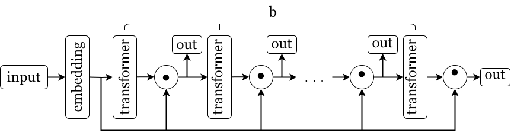
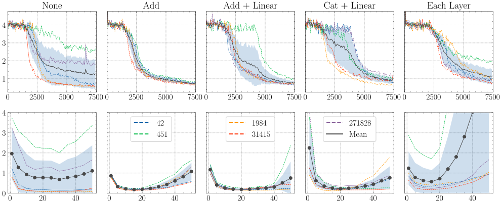

## Эксперимент №4: сравнение различных Input Injection методов.

### Проблема

В исходной статье и в наших экспериментах Input Injection выполняется посредством сложения. Что будет, если мы поменяем сложение на какую-либо другую операцию?

Обозначим $E =$ `embedding`$(input)$. Мы рассматриваем следующие методы:

1. Сложение:
```math
f(E, \text{pred}) = E + \text{pred}
```
2. Сложение и умножение на обучаемую матрицу:
```math
f(E, \text{pred}) = (E + \text{pred}) \cdot W
```
3. Конкатенация строк и умножение на обучаемую матрицу:
```math
f(E, \text{pred}) = [E, \text{pred}] \cdot W
```
4. Отсутствие какой-либо операции (ну или операция `Identity`) - выход итерации в неизменном виде идёт на вход трансформеру.

5. Использование сложения не перед каждой итерацией, а перед каждым слоем модели на каждой итерации. Иначе говоря, таких операций будет всего $b \times L$.

2 и 3 методы требуют небольшого изменения архитектуры. Теперь модель выдаёт предикты после Input Injection, а не до, как это было в случае со стандартной архитектурой (там это решение было принято потому, что для каждой новой итерации мы формируем новый инпут, а здесь мы по сути сделали дополнительный выходной слой блоку трансформера):



За подробностями реализации обратитесь к ноутбуку эксперимента. Стоит также отметить, что я рассматривал поэлементное умножение в качестве Input Injection метода, однако с ним выходили чересчур неудовлетворительные результаты, поэтому я пока отложил этот метод.

### Ожидаемый результат

Поскольку в методах 2 и 3 мы добавляем обучаемую матрицу в операцию Input Injection, мы потенциально можем увеличить эффективность модели благодаря тому, что модель сама будет выучивать оптимальное правило агрегирования информации из входных данных и выхода трансформера. Таким образом, метод 1 может оказаться менее эффективным.

### Дизайн эксперимента

В предыдущих экспериментах размерность данных была $8$, а на этот раз я использую размерность $12$. Размер батча был увеличен до $128$, а архитектура модели и число in-context примеров осталось тем же, что и в предыдущем эксперименте (на этот раз мы используем модель с обучаемым PE и стандартной каузальной маской). Также я изменил стандартное отклонение для генератора координат тренировочных данных с $1$ на $2$.

Каждую модель я обучаю с $b_{\text{train}} = 10$ и пятью зёрнами генерации: $42$, $451$, $1984$, $31415$, $271828$. Число итераций обучения составляет $7500$, и каждую модель мы обучаем с $\text{lr} = 5e-4$.

### Результаты

Валидация производилась не по 10 запускам для каждого зерна, а по 15, и каждый запуск выполнялся не на 10 батчах, а на 25. Результаты валидации представлены на рисунке.


Как мы можем видеть, обучение модели с простым сложением оказывается более стабильным, причём их средние результаты отличаются довольно слабо.

Если посмотреть на график функции потерь и экстраполяции для каждой модели, мы увидим больше различий:



Модель `Add` обучается гораздо более стабильно, однако она показывает не лучшую способность к экстраполяции. Интересно также и то, что она различна для запусков с одинаковым итоговым лоссом. Для каждой модели мы возьмём три запуска, которые показывают наилучший результат при $b = 50$, и получим следующую картину:


Таким образом, несмотря на средний лучший результат по 5 различным зёрнам генерации, который означает и более стабильное обучение модели, мы способны получить лучший результат и - что более важно для наших экспериментов с Looped Transformer - лучшую экстраполяцию, чем у стандартного сложения, с использованием других методов Input Injection. Возможно, что добавление более экспрессивного слоя в эту операцию позволит улучшить результат ещё сильнее. С другой стороны, это увеличивает нестабильность обучения.
